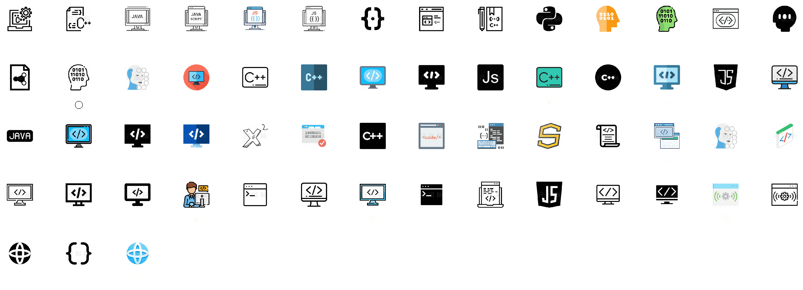

<h1 style="text-align:center">Home</h1>

***

** 也许你关心：**

- [系统设计（解耦、模块化设计、数据安全保障）](https://leesamoyed.github.io/research-development-design/system-design/decoupling/)

- [云原生开发与部署](https://leesamoyed.github.io/cloud-native/build-ops/aks-qduoj/)

- [嵌入式落地项目](https://leesamoyed.github.io/embedded/development-board/jetson-vision/)

***

***

欢迎访问 Wiki 的首页！这里有[自我介绍](https://leesamoyed.github.io/aboutme/)

Wiki主要用于整理学习成果、学习路线以及分享一些我觉得好玩儿的东西。这是一个快乐的攻城狮的Wiki~~~

★代表重点（主要为原创或踩坑章节文章）

往期笔记格式整理中！！！

任何问题(资料过期、内存存误、学习交流)可以直接联系我 <a href="mailto:leesamoyed@163.com">E-mail</a>

***

<h2 style="text-align:center">仰望心空脚踏实地</h2>

